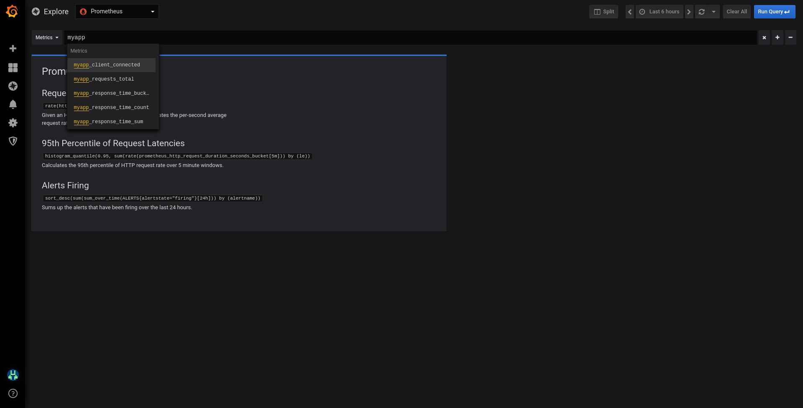
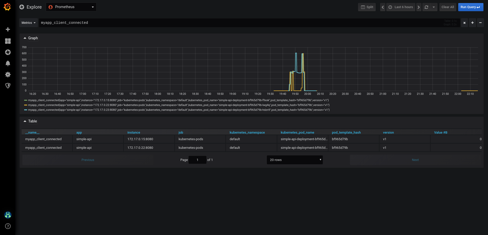

# Kubernetes: hpa with custom metrics and istio.

## How to launch the POC.

### Create a minikube-istio-metallb cluster.

```sh
git clone https://gitlab.com/roberto-majadas/minikube-istio-metallb.git
cd minikube-istio-metallb cluster
./boostrap.sh
```

### Install the simple-api and the hpa.

```sh
kubectl applay -f simple-api.yaml
```

This yaml crete the following components:
- Deployment: simple-api-deployment
- Service: simple-api-service
- VirtualService: simple-api-route
- DestinationRule: simple-api-destination
- HorizontalPodAutoscaler: simple-api-hpa

The simple ap has the following Go code.

```go
package main

import (
	"fmt"
	"log"
	"net/http"
	"os"
	"strconv"
	"time"

	"github.com/prometheus/client_golang/prometheus"
	"github.com/prometheus/client_golang/prometheus/promauto"
	"github.com/prometheus/client_golang/prometheus/promhttp"
)

type PrometheusHttpMetric struct {
	Prefix                string
	ClientConnected       prometheus.Gauge
	TransactionTotal      *prometheus.CounterVec
	ResponseTimeHistogram *prometheus.HistogramVec
	Buckets               []float64
}

var (
  latency = prometheus.NewHistogram(
     prometheus.HistogramOpts{
        Name:      "myapp_server_latency",
        Help:      "Latency",
     })
)

func InitPrometheusHttpMetric(prefix string, buckets []float64) *PrometheusHttpMetric {
	phm := PrometheusHttpMetric{
		Prefix: prefix,
		ClientConnected: promauto.NewGauge(prometheus.GaugeOpts{
			Name: prefix + "_client_connected",
			Help: "Number of active client connections",
		}),
		TransactionTotal: promauto.NewCounterVec(prometheus.CounterOpts{
			Name: prefix + "_requests_total",
			Help: "total HTTP requests processed",
		}, []string{"code", "method"},
		),
		ResponseTimeHistogram: promauto.NewHistogramVec(prometheus.HistogramOpts{
			Name:    prefix + "_response_time",
			Help:    "Histogram of response time for handler",
			Buckets: buckets,
		}, []string{"handler", "method"}),
	}

	return &phm
}

func (phm *PrometheusHttpMetric) WrapHandler(handlerLabel string, handlerFunc http.HandlerFunc) http.Handler {
	handle := http.HandlerFunc(handlerFunc)
	wrappedHandler := promhttp.InstrumentHandlerInFlight(phm.ClientConnected,
		promhttp.InstrumentHandlerCounter(phm.TransactionTotal,
			promhttp.InstrumentHandlerDuration(phm.ResponseTimeHistogram.MustCurryWith(prometheus.Labels{"handler": handlerLabel}),
				handle),
		),
	)
	return wrappedHandler
}

func myHandler(w http.ResponseWriter, r *http.Request) {
	cost := r.FormValue("cost")
	val, err := strconv.ParseFloat(cost, 64)
	if err != nil {
		http.Error(w, "Fail to convert cost as float value", 500)
		return
	}

	sleep := time.Duration(val*1e+9) * time.Nanosecond
	time.Sleep(sleep)
  latency.Observe(val)
	fmt.Fprintf(w, "Time spend for this request: %.2f", sleep.Seconds())
}

func main() {
  prometheus.MustRegister(latency)
	phm := InitPrometheusHttpMetric("myapp", prometheus.LinearBuckets(0, 5, 20))

	http.Handle("/metrics", promhttp.Handler())
	http.Handle("/service", phm.WrapHandler("myhandler", myHandler))

	port := os.Getenv("LISTENING_PORT")

	if port == "" {
		port = "8080"
	}
	log.Printf("listening on port:%s", port)

	err := http.ListenAndServe(":"+port, nil)
	if err != nil {
		log.Fatalf("Failed to start server:%v", err)
	}
}
```

This rest api has 3 important parts:
1. `InitPrometheusHttpMetric`: 3 new prometheus metrics.
 - myapp_client_connected
 - myapp_requests_total
 - myapp_response_time
2. `/metrics`: url to expose metrics to prometheus.
3. `/service?cost=X`: url to create a http call with a delay of X seconds.

### Install the custom metrics adapter and modify its configmaps.

#### Prometheus custom metrics: k8s-prometheus-adapter

[k8s-prometheus-adapter](https://github.com/DirectXMan12/k8s-prometheus-adapter) is an implementation of the Kubernetes
[resource metrics](https://github.com/kubernetes/community/blob/master/contributors/design-proposals/instrumentation/resource-metrics-api.md) API and
[custom metrics](https://github.com/kubernetes/community/blob/master/contributors/design-proposals/instrumentation/custom-metrics-api.md) API.

This adapter is therefore suitable for use with the autoscaling/v2 Horizontal Pod Autoscaler in Kubernetes 1.6+.  
It can also replace the [metrics server](https://github.com/kubernetes-incubator/metrics-server) on clusters that already run Prometheus and collect the appropriate metrics.

To install this adapter run the following command.

```sh
helm install --name adapter stable/prometheus-adapter --values custom-metrics/values.yaml
```

Now, you need add our custom metrics. To do this, you need to modify the default configmap.
At the end of this docs, you can see hoe to create this custom metrics.

```sh
kubectl delete configmaps adapter-prometheus-adapter
kubectl create -f custom-metrics/config-map-custom-metrics.yaml
```

Now, restart the adapter pod.

```sh
kubectl delete --all pods --namespace=default
# kubectl delete pods adapter-prometheus-adapter-*
kubectl get --raw /apis/custom.metrics.k8s.io/v1beta1 | jq .
```

### Test the hpa

You need to open 2 terminals, one to see the hpa evolution and other to launch a python app to create several concurrent connections to the simple-api.

#### Terminal 1

```sh
watch kubectl get hpa
```

#### Terminal 2

Install the dependencies and launch the python API to create the connections pull with the api.

```sh
pip install -r test/requirements.txt
python test/main.py
```

### How to create the custom metrics.

First of all is to see how the metrics are in the grafana (or prometeus) server. With our cluster, we can see this information in the [grafana dashboard](192.168.99.96:15031).
- User: grafana
- Password grafana12345

In the Explore sections we can search our new custom metrics:



And, if we explore one of this metrics, you can see something like this example with 3 replicas of the simple-api.



To create our custo metrics we need to review the fields name of one of the graphs, for example:

`myapp_client_connected{app="simple-api",instance="172.17.0.15:8080",job="kubernetes-pods",kubernetes_namespace="default",kubernetes_pod_name="simple-api-deployment-bf965d79b-f9xxk",pod_template_hash="bf965d79b",version="v1"}`

We will use the `kubernetes_pod_name` and the `kubernetes_namespace` to split our metrics by our different pods.

Now, we can create our first custom metrics, `myapp_client_connected`

```yaml
- seriesQuery: 'myapp_client_connected' # the name of the main metric
  seriesFilters: []
  resources:
    overrides:
      kubernetes_namespace:
        resource: namespace # Split this metric by namespace
      kubernetes_pod_name:
        resource: pod # Split this metric by pod name
  name:
    matches: "myapp_client_connected"
    as: ""
  metricsQuery: <<.Series>>{<<.LabelMatchers>>,container_name!="POD"}
```

Now, we are going to create a custom metrics with the average latency of the last 2 minutes using the `myapp_response_time_sum` and the `myapp_response_time_count`, using a PromQL query `rate(myapp_response_time_sum[2m]) / rate(myapp_response_time_count[2m])`

```yaml
- seriesQuery: 'myapp_response_time_sum'
  seriesFilters: []
  resources:
    overrides:
      kubernetes_namespace:
        resource: namespace
      kubernetes_pod_name:
        resource: pod
  name:
    matches: "myapp_response_time_sum"
    as: ""
  metricsQuery: 'rate(myapp_response_time_sum[2m]) / rate(myapp_response_time_count[2m])'
```

This is the final configmap file:

```yaml
apiVersion: v1
kind: ConfigMap
metadata:
  labels:
    app: prometheus-adapter
    chart: prometheus-adapter-v0.4.1
    heritage: Tiller
    release: adapter
  name: adapter-prometheus-adapter
  namespace: default
data:
  config.yaml: |
    rules:
    - seriesQuery: 'myapp_response_time_sum'
      seriesFilters: []
      resources:
        overrides:
          kubernetes_namespace:
            resource: namespace
          kubernetes_pod_name:
            resource: pod
      name:
        matches: "myapp_response_time_sum"
        as: ""
      metricsQuery: 'rate(myapp_response_time_sum[2m]) / rate(myapp_response_time_count[2m])'
    - seriesQuery: 'myapp_client_connected'
      seriesFilters: []
      resources:
        overrides:
          kubernetes_namespace:
            resource: namespace
          kubernetes_pod_name:
            resource: pod
      name:
        matches: "myapp_client_connected"
        as: ""
      metricsQuery: <<.Series>>{<<.LabelMatchers>>,container_name!="POD"}
```
